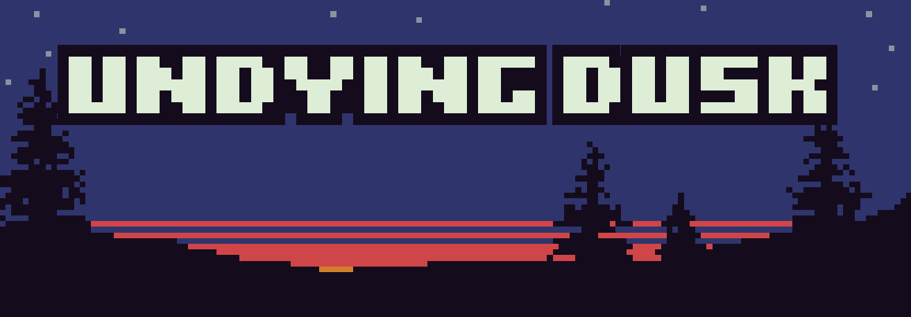

<!-- NEXT STEPS:
- reduce the 1324x16 & 1598x16 states of the final fight 2 phases ?
- add SFX for spells: cf. https://www.patreon.com/posts/dark-magic-8600078 & https://www.patreon.com/posts/light-magic-8781428 + attacks-sfx.md
- create itch.io page
- Androïd & Linux PDF readers?
- post-release: publish assets
- a11y? questions to Sandra Bruel: + quels lecteurs PDF vos amis emploient ?
- feedback Maxime:
  * MUSIC: certaines sont trop rapprochées
  * seamus fight without buckler frustrating
  * skeleton fight : too hard ? hint at critical ?
- code clean-up:
  * rename CutScene -> Dialog + (scene_id/shop_id -> dialog_id) + get rid for old Proxy(item=[...]) struct in build_dialog_options + rm ShopMessageItem
  * maze rendering glitch
  * make "mod" a class instance, so that customization no more relies on imports, and make mapscript.SCRIPTS_PER_TILE a class property
- VF?
- size improvements:
  * 34M music/AlexandrZhelanov-ADarknessOpus.ogg
  * stats on what fights / tiles get the most rendered
  * MARGINAL EXPECTED EFFECT: pngoptimizer / optimize tilesets : many have redundant sections, a pre-rendering pass could extract tiles from tilesets and put them in a unique PNG, with mappings for the rendering step
- ideas for another time:
  * ajouter un journal rappelant tous les indices trouvés, à apparition unique (idée Henri)
  * animations (with full page clickable): crack opening, moving box, raising portcullis, contextual actions...
  * for a sequel, start off with Empress chasing player! (not doable due to #states explosion with secrets)
    -> must go back through whole level without slowing down, with Empress following
    -> pickup itemX * 3 (with buckler?) on the way, in order to face Empress again with 3 throwable weapons
  * dialogs choices inspired by Monkey Island Insult Sword Fighting,
    where there's a unique set of answers that leads to victory
  * drunk/potion -> mess with direction arrows (reversed / all over the page)
  * moving enemy: either with a looping pattern, or that must be caught when running away, thanks to a shortcut
  * cloak to bypass enemy (avoid an encounter)
  * enemy with several hit zones, where the pattern to beat it is the solution of a logic puzzle
  * light up torch and go to some place previously very dark
  * place bomb on stone door doorstep (require a "broken wall" tile)
  * item to jump/teleport over a fixed distance
  * offer choices that matter on the ending
  * perso conscient d'être dans un PDF
  * ACTIONS from dawnlike-level-16x16.png: bed, skull, rope, glove, diamond, snake, crown
                 dawnlike-npcs-16x16.png: interrogation mark, shadow form
  * try other PDF features: PrevPage ? sub-page navigation ?
  * implement monster arrival animations & attacks & delayed log msgs using PDF `Transitions` or as a GIF (_cf._ [Patrick Gallot article](https://www.datalogics.com/blog/corporate/the-making-of-a-pdf-presentation/))
  * use navigation node `Dur` to implement QTEs / real-time game mechanics ?
  * enemies: griffon, allacrost daemarbora, demonic_essence & skeleton_with_axe, Cethiel-Dragon
  * great illustrations: fortuneteller, animated_torch, knight, lylfDW-wizard, TheSamta-Crusader
- secrets: ABYSS_BOTTOM, DEAD_TREE, FOUNTAIN_WISH, KONAMI_CODE
  * [x] empress soul at the bottom of the abyss
  * [x] throwing gold piece in fountain (hint hidden on a special wall sprite)
  * [x] beating the shadow soul once equipped with armor, giving access to the dead tree
  * [x] konami code on last map
- hidden in original sources:
  * 3 monsters: goblin, storm dragon & violence demon
  * 3 extra spells: LIGHT, FREEZE & REFLECT
  * extra equipment: 4 armors & 4 weapons
  * extra background: snowy forest
-->

**Undying Dusk** is a video game in a PDF format,
with a gameplay based on exploration and logic puzzles,
in the tradition of [dungeon crawlers](https://en.wikipedia.org/wiki/Dungeon_crawl#Video_games).

The game is set in a fantasy realm where a curse set by the Empress keeps the world in an eternal dusk.
You play a woman who recently found shelter in an eerie monastery.

It features:
- 200 000 PDF pages
- a retrogaming aesthetic: 160x120 pixels resolution and a 16 colors palette
- a grid-based world with 50 different tiles and 10 maps to explore
- more than 30 treasure items, weapons & spells to pick up in order to face 15 enemy monsters
- 20 music tracks
- thousands of "Game Over" pages, and a single path to victory
- 4 hidden secrets & a concealed epilogue
- an online [hall of fame](https://chezsoi.org/lucas/undying-dusk/hall-of-fame)

It was made during the summer of 2020 by Lucas Cimon.
To my knowledge, this is the very first video game in a PDF format.

[Dedicated SubReddit](https://www.reddit.com/r/UndyingDuskPdfGame)

## Trailer

## Download
Download links for all versions can be found here: [GitHub Releases](https://github.com/Lucas-C/undying-dusk/releases)

Release notes: [CHANGELOG.md](CHANGELOG.md)

### For Windows gamers
There is ZIP archive you can download for every version on the [GitHub Releases](https://github.com/Lucas-C/undying-dusk/releases) page:
it contains the PDF game **and** Sumatra PDF 3.1.2.

Once the ZIP content is extracted in a folder, you just have to double-click on the `LAUNCH_UNDYING_DUSK_IN_SUMATRA.bat` file to start the game.

This will allow you to play with the PDF reader that is best compatible with the game,
**without** installing it globally on your computer.

## Compatible PDF readers
You will find below a comparison table of how well several PDF readers wil let you play to Undying Dusk.
Notably, Adobe Acrobat Reader does **not** perform well to render the game.

PDF reader: /Criteria | Sumatra PDF \* | MuPDF | Xpdf | FoxIt | Adobe Acrobat | Chrome native | Firefox native (PDF.js) | Javelin3 | Slim | Utopia
-|-|-|-|-|-|-|-|-|-|-
can load the game              | ✔️ | ✔️ | ✔️ | ✔️ | ✔️ | ✔️ | ❌ | ❌ | ❌ | ❌ |
no visual artifact             | ✔️ | 🤔 | ✔️ | ✔️ | ☹️ | ✔️ | ❌ | ✔️ | ❌ | ❌ |
follow links                   | ✔️ | ✔️ | ✔️ | ✔️ | ✔️ | ✔️ | ✔️ | ✔️ | ❌ | ✔️ |
fast nav / ok page render time | ✔️ | ✔️ | 🤔 | ✔️ | ☹️ | ☹️ | -  | -  | -  | -  |
ALT+🡄 "back" key binding       | ✔️ <em>backspace</em> also works | `t` must be used instead | ✔️ | ❌ | ✔️ | ❌ | ✔️ | ?  | ?  | ?  |
"back" history size            | 50 | 256 | 49 | ❌ | 31 | ❌ | 49 | ?  | ?  | ?  |

\* Please use Sumatra PDF version 3.1.2, that can be download on [this page](https://www.sumatrapdfreader.org/download-prev.html). The latest 3.2 version [has difficulties opening Undying Dusk](https://github.com/Lucas-C/undying-dusk/issues/3). This should be solved in the next release of Sumatra PDF.

We only recommend PDF readers that meet all of the above criteria.

Questions & edits on this table are welcome through _issues_ & _PRs_.

## Credits & attribution
### Heroine Dusk
Undying Dusk is basically a PDF port / [total conversion](https://en.wikipedia.org/wiki/Mod_(video_games)#Total_conversion)
of [Clint Bellanger](http://clintbellanger.net) wonderful [Heroine Dusk](http://heroinedusk.com) game,
with different game mechanics & slightly expanded.

I cannot thank him enough for providing the foundations of this game,
under a GPL v3 / CC-BY-SA 3.0 license:
high quality Javascript source code of a retro dungeon-crawler game engine,
and numerous gorgeous visual assets of tiles, enemies & items.
Thank you Clint!

### Graphical assets
First of all, this game uses the great 16 color palette made by [DawnBringer at PixelJoint](http://www.pixeljoint.com/forum/forum_posts.asp?TID=12795). 

This game also makes use of the following assets, some of which I ported to the DawnBringer palette:
- all [the original art](https://opengameart.org/content/first-person-dungeon-crawl-art-pack) was made by Clint Bellanger for the original Heroine Dusk game - [CC BY-SA 3.0](https://creativecommons.org/licenses/by-sa/3.0/)
- enemies come from [Redshrike remix of Heroine Dusk original ones](https://opengameart.org/content/first-person-dungeon-crawl-enemies-remixed).
Seamus wizard, demon & gorgon portraits from his [6 More RPG Enemies spritesheet](https://opengameart.org/content/6-more-rpg-enemies), black bird from his [Tower Defense Prototyping Assets]( https://opengameart.org/content/tower-defense-prototyping-assets-4-monsters-some-tiles-a-background-image) and blowfish from his [3 RPG enemy remixes](https://opengameart.org/content/3-rpg-enemy-remixes) - all [CC BY-SA 3.0](https://creativecommons.org/licenses/by-sa/3.0/)
Shadow soul extra frames come from [Bosses and monsters spritesheets (Ars Notoria) by Balmer](https://opengameart.org/content/bosses-and-monsters-spritesheets-ars-notoria) - [CC BY 3.0](https://creativecommons.org/licenses/by/3.0/)
- most new sprites (direction arrow, items, tiles) come from the awesome [_Recolor all the items!!!_ spritesheet by Marcus Ihde](https://opengameart.org/content/recolor-all-the-items) - [CC-BY-SA 3.0](https://creativecommons.org/licenses/by-sa/3.0/)
- bible, fish & scroll 16x16 icons from [Kyrise's Free 16x16 RPG Icon Pack](https://opengameart.org/content/kyrises-free-16x16-rpg-icon-pack) - [CC BY 4.0](https://creativecommons.org/licenses/by/4.0/)
- cloudy town, animated flying demon, prie-dieu, statue, wood box & well from [GothicVania Patreon Collection](http://pixelgameart.org/web/portfolio/gothicvania/), [GothicVania Church assets](https://opengameart.org/content/gothicvania-church-pack), [GothicVania Cemetery assets](https://opengameart.org/content/gothicvania-cemetery-pack), [GothicVania Town assets](https://opengameart.org/content/gothicvania-town), [Forest Background](https://opengameart.org/content/forest-background) & [Mountain at Dusk Background](https://opengameart.org/content/mountain-at-dusk-background) by Luis Zuno (@ansimuz) - public domain
- [forest fringe](https://opengameart.org/content/forest-and-grave) & [valley village](https://opengameart.org/content/village-in-the-valley) backgrounds by trulio - [CC BY 3.0](https://creativecommons.org/licenses/by/3.0/)
- [!$dungeon Of Sorrow Gate](https://www.deviantart.com/nicnubill/art/dungeon-Of-Sorrow-Gate-407553705) & [!$Secret Passage](https://www.deviantart.com/nicnubill/art/Secret-Passage-716158385) by Nicnubill
- portcullis from [LPC castle by Evert](https://opengameart.org/content/lpc-castle) - [CC BY 3.0](https://creativecommons.org/licenses/by/3.0/)
- cauldron & fire from [[LPC] Dungeon Elements by Sharm](https://opengameart.org/content/lpc-dungeon-elements) - [CC BY 4.0](https://creativecommons.org/licenses/by/4.0/)
- [Boulder pixel art by TdeLeeuw](https://www.deviantart.com/tdeleeuw/art/Boulder-pixel-art-427731885) - [CC BY-NC-SA 3.0](https://creativecommons.org/licenses/by-nc-sa/3.0/)
- portal by [LetargicDev](https://opengameart.org/content/portals) - CC0
- dead tree by [JRob774](https://opengameart.org/content/dead-tree-1) - [CC BY 3.0](https://creativecommons.org/licenses/by/3.0/)
- health bar from [Buch Golden UI](https://opengameart.org/content/golden-ui) - CC0
- torch on wall from [Blackspire studio Medieval PixelArt assets](https://blackspirestudio.itch.io/medieval-pixel-art-asset-free)
- small amulet & magnifying glass from [
DawnLike 16x16 Universal Rogue-like tileset
](https://opengameart.org/content/dawnlike-16x16-universal-rogue-like-tileset-v181) by DragonDePlatino - [CC BY 4.0](https://creativecommons.org/licenses/by/4.0/)
- distant castle background by [jkjkke](https://opengameart.org/content/background-6) - [CC BY 3.0](https://creativecommons.org/licenses/by/3.0/)
- palace hall & ruins background from [CraftPix.net 2D Game Assets](https://opengameart.org/content/pixel-art-fantasy-game-battlegrounds) - [OGA-BY 3.0](https://opengameart.org/content/oga-by-30-faq)
- Dominik portrait from [Blarumyrran faceset 2-bit](https://opengameart.org/content/faceset-2-bit) - CC0
- Seamus portrait from [RPG portraits by Buch](https://opengameart.org/content/rpg-portraits) - CC0
- Monk from [Oracle Portrait by Justin Nichol](https://opengameart.org/content/oracle-portrait) - [CC BY-SA 3.0](https://creativecommons.org/licenses/by-sa/3.0/)
- Monk portrait from [Wizard by lylfDW](https://opengameart.org/content/wizard-7) - CC0
- small storm dragon [by Sharm](https://opengameart.org/content/rpg-enemies-11-dragons) - [CC BY 3.0](https://creativecommons.org/licenses/by/3.0/)
- [open book by Min](https://opengameart.org/content/open-book-0) - CC0
- stump made from [Snake on an old stump by Angry Amish](https://opengameart.org/content/snake-on-an-old-stump) - CC0
- hangman from [Fantasy Tiles by surt](https://opengameart.org/content/fantasy-tiles) - CC0
- [Temple background by Ironthunder](https://opengameart.org/content/temple-background) - [CC BY 4.0](https://creativecommons.org/licenses/by/4.0/)
- boat from [Mythical Ruins Tileset by voec](https://opengameart.org/content/mythical-ruins-tileset) - CC0
- knight from [Dungeon Crawl 32x32 tiles](https://opengameart.org/content/dungeon-crawl-32x32-tiles) - CC0
- other knight from [2d Lost Garden Zelda style tiles resized to 32x32 with additions](https://opengameart.org/node/11758) by Daniel Cook, Jetrel, Saphy (TMW), Zabin, Bertram - [CC BY 3.0](https://creativecommons.org/licenses/by/3.0/)
- small mimics from [Chest and Mimic by IndigoFenix](https://opengameart.org/content/chest-and-mimic) - [CC BY 3.0](https://creativecommons.org/licenses/by/3.0/)
- [blood splat by PWL](https://opengameart.org/content/blood-splats) - [CC BY 3.0](https://creativecommons.org/licenses/by/3.0/)
- [Rose Flower by Lovecraft](https://opengameart.org/content/rose-flower-pyxeledit-document-and-image) - CC0
- fish-on-a-stick & hand mirror from [496 pixel art icons for medieval/fantasy RPG by Henrique Lazarini (7Soul1)](https://opengameart.org/content/496-pixel-art-icons-for-medievalfantasy-rpg) - CC0
- knight & skeleton portrait from [32x32 Fantasy portrait set by CobraLad](https://opengameart.org/content/32x32-fantasy-portrait-set) - [CC BY 3.0](https://creativecommons.org/licenses/by/3.0/)
- explosion from [Lots of free 2d tiles and sprites by Hyptosis](https://opengameart.org/content/lots-of-free-2d-tiles-and-sprites-by-hyptosis) - [CC BY 3.0](https://creativecommons.org/licenses/by/3.0/)
- [SNES JRPG Background: Snowy Village by Inkerrio](https://www.deviantart.com/inkerrio/art/SNES-JRPG-Background-Snowy-Village-794916075)
- attacks SFXs from [Dungeon Crawl Stone Soup](http://crawl.develz.org/wordpress/) - CC0
- gorgon's staff downscaled from [Staff by LordNeo](https://opengameart.org/content/staff-64-x64)
<!--
* griffon: Lanea Zimmerman (AKA Sharm) https://forums.rpgmakerweb.com/index.php?threads/sharms-stuff.26278/
* scene_cave: https://opengameart.org/content/parallax-halloween-2d-game-backgrounds
-->

All the OpenGameAssets have been gathered in [this collection](https://opengameart.org/content/art-for-undying-dusk-pdf-game).

### Fonts
The Boxy Bold font was made [by Clint Bellanger for Heroine Dusk](https://opengameart.org/content/boxy-bold-font).

It was packaged into a `.ttf` file by [William Thompson](https://opengameart.org/content/boxy-bold-truetype-font) and released in the public domain,
with lowercase letters added.

However this `.ttf` file has many minor differences with Clint Bellanger original font:
it is monospaced, the character spacing is larger and the `"`, `'`, `1`, `2`, `I`, `S`, `{`, `}` & `~` characters are not rendered identically.

During the development of this game, 2 new fonts were created from William Thompson `Boxy-Bold.ttf`.
Both are released into the public domain:
- `Boxy-Bold-Black.otf` : an [OpenType SVG font](https://fr.wikipedia.org/wiki/OpenType-SVG))
allowing to preserve the black outline while changing the characters color.
Sadly this kind of font cannot be embedded in a PDF, as of september 2020.
- `Boxy-Bold-Light.otf` : a trimmed down variant of `Boxy-Bold.ttf`,
that was used for an earlier prototype version of the game in order to add a "layer of color"
on top of black characters.

### Music
Songs used in the game :
- [M31 by Yubatake](https://soundcloud.com/yubatake/m31) - [CC BY 3.0](https://creativecommons.org/licenses/by/3.0/)
- [A Darkness Opus](https://opengameart.org/content/a-darkness-opus), [Audience](https://opengameart.org/content/audience), [Caves of sorrow](https://opengameart.org/content/caves-of-sorrow), [Dark Hall](https://opengameart.org/content/north-wind-more-music-inside), [Full of memories](https://opengameart.org/content/full-of-memories), [Insight](https://opengameart.org/content/insight), [Journey to the East Rocks](https://opengameart.org/content/journey-to-the-east-rocks) [Mystery Forest](https://opengameart.org/content/mystery-forest), [Mystical Theme](https://opengameart.org/content/mystical-theme) & [Treasures Of Ancient Dungeon 2](https://opengameart.org/content/treasures-of-ancient-dungeon-2) by Alexandr Zhelanov - [CC BY 3.0](https://creativecommons.org/licenses/by/3.0/)
- [10 Mysteries of The Mechanical Prince](https://opengameart.org/content/10-mysteries-of-the-mechanical-prince) by Tomasz Kucza (Magnesus) - [CC BY 3.0](https://creativecommons.org/licenses/by/3.0/)
- [Fantasy Music - Night Town by Angus Macnaughton](https://opengameart.org/content/fantasy-music-night-town) - [CC BY 4.0](https://creativecommons.org/licenses/by/4.0/)
- [Dark Winds](https://opengameart.org/content/orchestral-epic-fantasy-music) & [Orchestral Looming Battle](https://opengameart.org/content/orchestral-battle-music) by Johan Jansen (Zefz) - [CC BY 3.0](https://creativecommons.org/licenses/by/3.0/)
- [Dark Descent](https://opengameart.org/content/dark-descent), [Defying Commodus](https://opengameart.org/content/defying-commodus), [Heroic Demise](https://opengameart.org/content/heroic-demise-updated-version), [Soliloquy](https://opengameart.org/content/soliloquy), [Spiritwatcher](https://opengameart.org/content/spiritwatcher) & [The Fall of Arcana](https://opengameart.org/content/the-fall-of-arcana-epic-game-theme-music) by Matthew Pablo - [CC BY 3.0](https://creativecommons.org/licenses/by/3.0/)
- [Old Crypt by Janne Hanhisuanto](https://opengameart.org/content/radakan-old-crypt) - [CC BY 3.0](https://creativecommons.org/licenses/by/3.0/)
- [Walking with Poseidon by Marcus Rasseli](https://opengameart.org/content/walking-with-poseidon) - [CC BY 3.0](https://creativecommons.org/licenses/by/3.0/)

They have all been collected in [this collection on OGA](https://opengameart.org/content/music-for-undying-dusk-pdf-game).

Also, this game was mostly coded while listening to _Lance's Dark Mood Party Mixes_!

### Playtesters
A huge THANK YOU to Henri Crouzet & Maxime Lemanach for their precious feedbacks!

Many thanks also to Thibault Toledano for the cheerful support and the bright suggestions
of elements to include in the game!

## Tools used
- Python programming language
- [Notepad++](https://notepad-plus-plus.org)
- [Sumatra PDF reader](https://www.sumatrapdfreader.org)
- [Firefox](https://www.mozilla.org/fr/firefox/)
- [Gimp](https://www.gimp.org) with a plugin to upscale sprites:
[gimp-plugin-pixel-art-scalers](https://github.com/bbbbbr/gimp-plugin-pixel-art-scalers) by bbbbbr and its Scale2X filter
<!-- Alternatives:
* [scalepx.py](https://github.com/pixlsus/registry.gimp.org_static/blob/master/registry.gimp.org/files/scalepx.py.txt)
Gimp plugin by VK and its Eagle2x filter, cf. https://opengameart.org/forumtopic/pixelart-scaler-scalenx-and-eaglenx-for-gimp
* testé, très complet: https://github.com/Hawkynt/2dimagefilter
* non testé: https://github.com/gamestdio/hqx
-->

## Build steps

    git clone https://github.com/clintbellanger/heroine-dusk
    pip install -r requirements.txt
    ./gen_pdf.py

To launch the original Heroine Dusk web version:

    cd heroine-dusk/release/; python3 -m http.server 8888; cd -

## License
The code for Undying Dusk is released under [GPL v3 license](https://www.gnu.org/licenses/gpl-3.0.en.html),
[climate-strike BSD](https://github.com/climate-strike/license/blob/master/licenses/BSD)
and [The Hippocratic License 2.1](https://firstdonoharm.dev).
All other content created for the game (text, images...) is under [CC-BY-SA 3.0](https://creativecommons.org/licenses/by-sa/3.0/) license.
